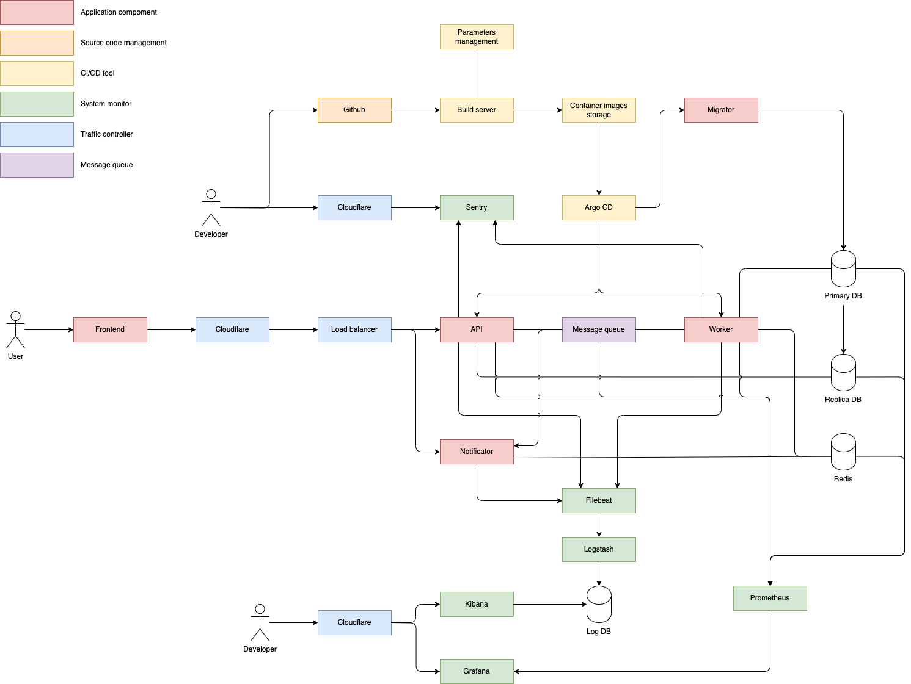
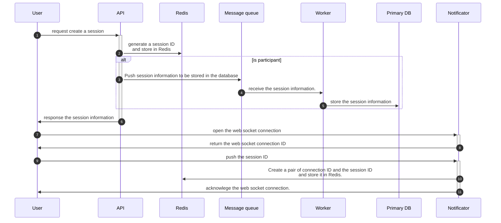
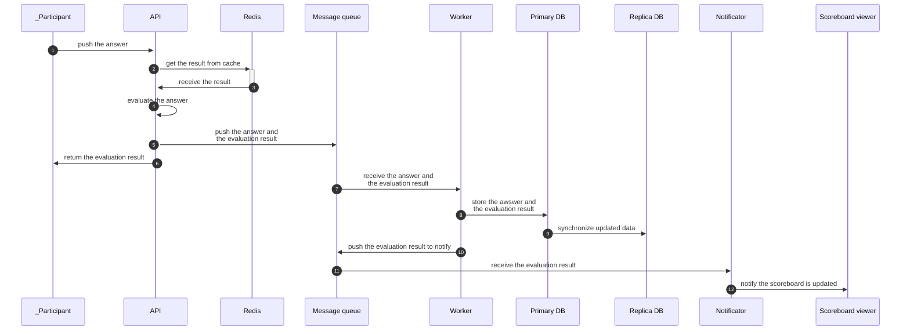
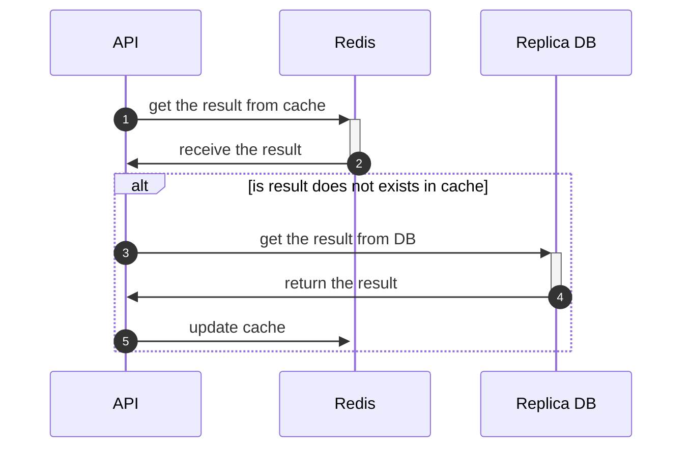

## 1. System design

### 1.1. Architecture diagram



### 1.2. Component description

#### 1.2.1. Application services

##### 1.2.1.1. API

This service receives requests from users, including creating sessions, receiving participants' answers, and retrieving the scoreboard.

The number of API workers can be increased based on the growth in the number of users.

##### 1.2.1.2. Notificator

This service notifies participants and scoreboard viewers of new updates, including question results and scoreboard changes.

The number of Notificator workers can be increased based on the growth in the number of users.

##### 1.2.1.3. Worker

This service serves the following purposes:

- Evaluating participants' answers.
- Writing participants' scores to the database.
- Broadcasting results to the Notificator via Message Queue to notify users of updates.

The number of Worker service workers can be increased based on the growth in the number of users.

##### 1.2.1.4. Migrator

This component migrates the database to new migration versions before other application components are deployed. If any unapplied migration versions are detected, we can roll back the database to investigate.

#### 1.2.2. CI/CD Tools

##### 1.2.2.1. Build server

This component receives build requests from GitHub Actions to build Kubernetes images.

##### 1.2.2.2. Parameters management

This component provides parameters for building or deploying services.

##### 1.2.2.3. Container images repository

This component manages Kubernetes image versions for deploying services or rolling back service versions when needed.

##### 1.2.2.4. Argo CD

This component declares and controls service definitions, configurations, and environments. It ensures that deployment and lifecycle management are automated, auditable, and easy to understand.

#### 1.2.3. System monitor

##### 1.2.3.1. Sentry

This component notifies application exceptions immediately.

##### 1.2.3.2. ELK

This component helps developers monitor services via logs. It includes three tools:

- **Filebeat**: Collects logs from services.
- **Logstash**: Parses and extracts information from logs, storing it in the Log database.
- **Kibana**: A GUI for developers to access logs.

##### 1.2.3.3. Metrics monitoring

This component helps developers monitor systems via metrics. It includes:

- **Prometheus**: Collects metrics from all components, including Kubernetes containers, databases, message queues, Sentry, log databases, and load balancers.
- **Grafana**: A GUI for developers to access metrics.

#### 1.2.4. Traffic controller

##### 1.2.4.1. Cloudflare

This component serves for DNS management, web security, and secure connections via SSL/TLS.

##### 1.2.4.2. Load balancer

Since all application components can be scaled using the horizontal scaling method, the load balancer dynamically distributes traffic across API, Notificator workers.

#### 1.2.6. Message queue

This component controls requests from participants to write the results to the database in case the number of API workers is increased.

#### 1.2.7. Database

##### 1.2.7.1. Primary database

This database receives write transations from Worker service workers to store data.

##### 1.2.7.2. Replica database

This database serves the following purposes:

- Receives read transations from API service workers and responds with the queried data.
- Receives updated data from the primary database for reading.

The number of replica databases can be increased based on the growth in the number of users.

##### 1.2.7.3. Redis

Redis serves the following purposes:

- Centralized storage for temporary data, including web socket information and session information.
- Caches expected answers for quiz questions to reduce the number of read transactions to the database.

### 1.2. Data flows

#### 1.2.1. Creating a new session



#### 1.2.2. Receive anwsers from participants



#### 1.2.3. Update cache for result

To prevent Redis from running out of memory, we apply a time-to-live (TTL) for values. However, this approach requires querying the database to update cached values. The update method is described by the following flow:



### 1.3. Technologies and tools

#### 1.3.1. Python

We use python with the following libraries:

- FastAPI: the web framework.
- Pika: the RabbitMQ client library.
- SQLAlchemy: the database ORM.

#### 1.3.2. Kubernetes

We use Kubernetes for the following purposes:

- **Resource Management**: Controls the resources (CPU, RAM, Disk) that each container needs.
- **Horizontal Scaling**: Increases or decreases the number of application containers based on user growth.
- **Load Balancing**: Distributes network traffic across multiple containers to ensure high availability and reliability of services.

Kubernetes can be deployed on AWS using **EKS**.

#### 1.3.3. PostgreSQL

We use PostgreSQL as the main database to store and query data.

The database is a bottleneck in the system because we cannot scale it as fast as possible when the number of users changes. To solve this problem, we use two databases:

- The primary database: Receives write transactions from Worker service containers. The number of transactions is controlled by using the message queue.
- The replica database: Receives read transactions from API service containers. We can increase the number of replica databases when the number of users changes.

PostgreSQL can be deployed on AWS using **RDS**.

#### 1.3.4. Redis

Redis serves the following purposes:

- Centralized storage for temporary data, including web socket information and session information.
- Caches expected answers for quiz questions to reduce the number of read transactions to the database.

We can apply Redis replication to handle a large number of users.

Redis can be deployed on AWS using **ElastiCache**.

#### 1.3.5. RabbitMQ

RabbitMQ is used for message queuing because of the following reasons:

- Queuing messages until they can be processed allows the system to process requests asynchronously and handle large volumes.
- Messages can be persisted, replicated, and acknowledged to ensure they are not lost, even if the system fails.
- It supports horizontal scaling, allowing multiple service containers to connect.
- It supports message acknowledgment, ensuring that a message is processed once and only once.
  RabbitMQ provides built-in tools for monitoring message queues, consumers, and system performance, allowing for effective management and debugging.

Redis can be deployed on AWS using **Amazon MQ**.

#### 1.3.6. Sentry

Sentry receives and notifies service exceptions immediately. We can self-host by using Kubernetes or use Sentry SaaS.

#### 1.3.7. Argo CD

Argo CD declares and controls service definitions, configurations, and environments. It ensures that deployment and lifecycle management are automated, auditable, and easy to understand.

#### 1.3.8. Amazon Elastic Container Registry (ECR)

Manage container images in AWS.

#### 1.3.9. ELK

This component helps developers monitor services via logs. It includes four tools:

- **Filebeat**: Collects logs from services.
- **Logstash**: Parses and extracts information from logs, storing it in the log database.
- **Elasticseach**: the database for storing logs.
- **Kibana**: A GUI for developers to access logs.

If we use AWS, we can substitute the ELK stack with **CloudWatch**.

#### 1.3.10. AWS Systems Manager (SSM)

Store the parameters in AWS for building or deploying services.

#### 1.3.11. Prometheus

Prometheus records metrics in a time series database built using an HTTP pull model, with flexible queries and real-time alerting.

#### 1.3.12. Grafana

Grafana helps developers access metrics in Prometheus via queries.

## 2. Implementation

### 2.1. Code structure

The code structure

```
api
| -- models.py
| -- main.py
notificator
| -- main.py
core
| -- db
|    | -- versions
|    | -- database.py
| -- domains
|    | -- quiz
|    |    | -- models
|    |    |    | -- quiz.py
|    |    |    | -- ...
|    |    |    | -- __init__.py
|    |    | -- actions
|    |    |    | -- submit_answer_action.py
|    |    | -- repository.py
|    | -- ...
| -- helpers
|    | -- string_helper.py
|    |
| -- services
|    | -- cache.py
|    | -- rabbitmq.py
|    | -- redis.py
| -- tests
|    | -- domains
|    |    | -- quiz
|    |    |    | -- test_submit_answer_action.py
```
