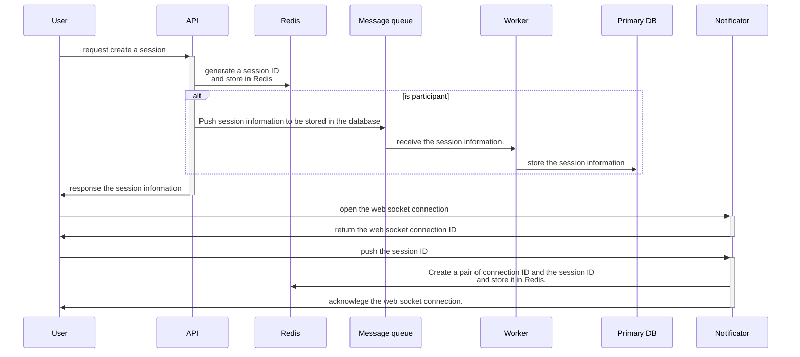

## 1. System design

### 1.1. Architecture diagram

### 1.2. Component description

#### 1.2.1. Application services

##### 1.2.1.1. API

This service receives requests from users, including creating sessions, receiving participants' answers, and retrieving the scoreboard.

##### 1.2.1.2. Notificator

This service notifies participants and scoreboard viewers of new updates, including question results and scoreboard changes.

##### 1.2.1.3. Worker

This service serves the following purposes:

- Evaluating participants' answers.
- Writing participants' scores to the database.
- Broadcasting results to the Notificator via Message Queue to notify users of updates.

##### 1.2.1.4. Migrator

This component migrates the database to new migration versions before other application components are deployed. If any unapplied migration versions are detected, we can roll back the database to investigate.

#### 1.2.2. CI/CD Tools

##### 1.2.2.1. Build server

This component receives build requests from GitHub Actions to build Kubernetes images.

##### 1.2.2.2. Parameters management

This component provides parameters for building or deploying services.

##### 1.2.2.3. Container images repository

This component manages Kubernetes image versions for deploying services or rolling back service versions when needed.

##### 1.2.2.4. Argo CD

This component declares and controls service definitions, configurations, and environments. It ensures that deployment and lifecycle management are automated, auditable, and easy to understand.

#### 1.2.3. System monitor

##### 1.2.3.1. Sentry

This component notifies application exceptions immediately.

##### 1.2.3.2. ELK

This component helps developers monitor services via logs. It includes three tools:

- **Filebeat**: Collects logs from services.
- **Logstash**: Parses and extracts information from logs, storing it in the Log database.
- **Kibana**: A GUI for developers to access logs.

##### 1.2.3.3. Metrics monitoring

This component helps developers monitor systems via metrics. It includes:

- **Prometheus**: Collects metrics from all components, including Kubernetes containers, databases, message queues, Sentry, log databases, and load balancers.
- **Grafana**: A GUI for developers to access metrics.

#### 1.2.4. Traffic controller

##### 1.2.4.1. Cloudflare

This component serves for DNS management, web security, and secure connections via SSL/TLS.

##### 1.2.4.2. Load balancer

Since all application components can be scaled using the horizontal scaling method, the load balancer dynamically distributes traffic across API, Notificator workers.

#### 1.2.6. Message queue

This component controls requests from participants to write the results to the database in case the number of API workers is increased.

#### 1.2.7. Database

##### 1.2.7.1. Primary database

This database receives write transations from Worker service workers to store data.

##### 1.2.7.2. Replica database

This database serves the following purposes:

- Receives read transations from API service workers and responds with the queried data.
- Receives updated data from the primary database for reading.

The number of replica databases can be increased based on the growth in the number of users.

##### 1.2.7.3. Redis

Redis serves the following purposes:

- Centralized storage for temporary data, including web socket information and session information.
- Caches expected answers for quiz questions to reduce the number of read transactions to the database.

### 2. Data flows

#### 2.1. Creating a new session

### 3. Technologies and tools

###
